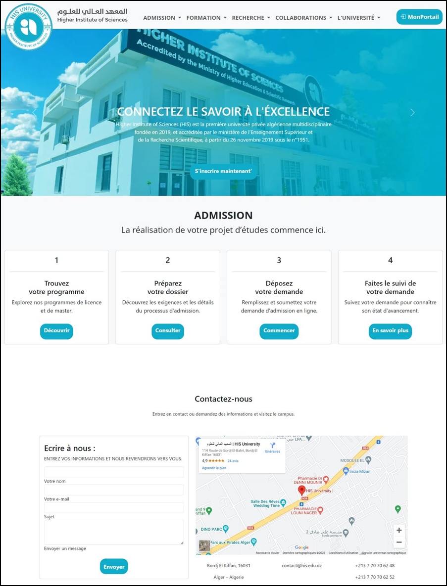
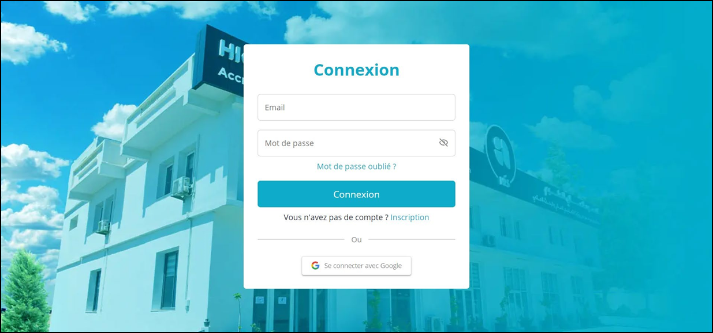
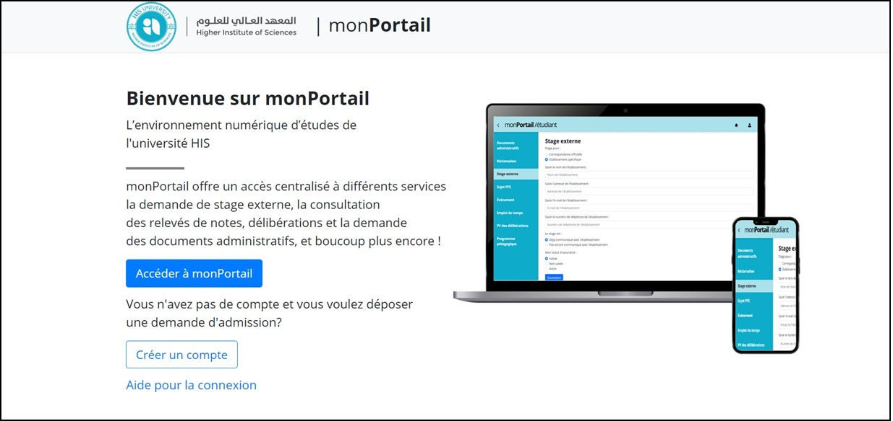
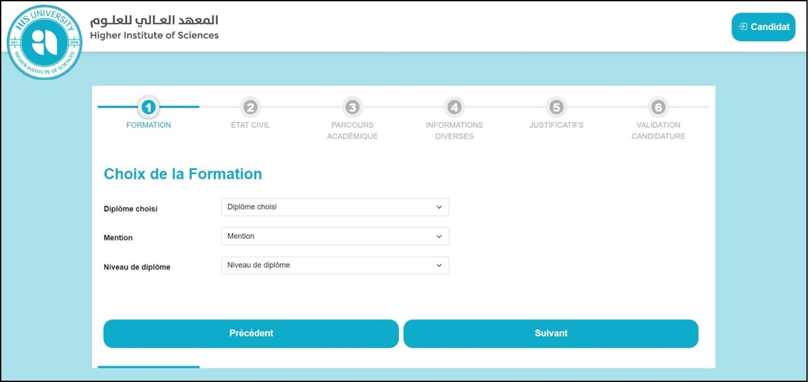
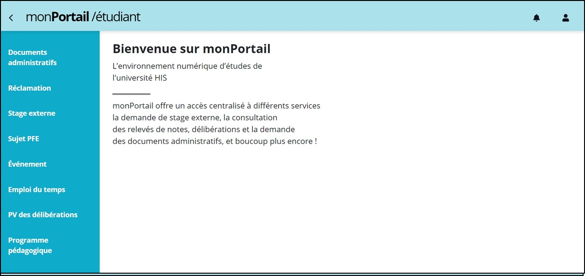
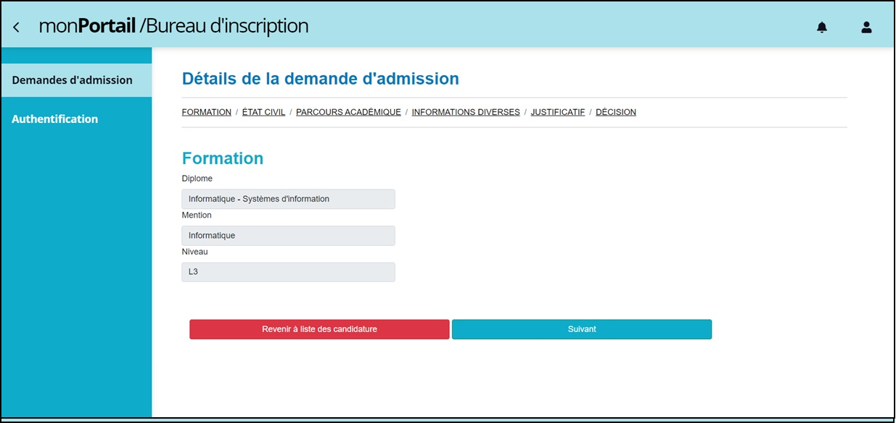
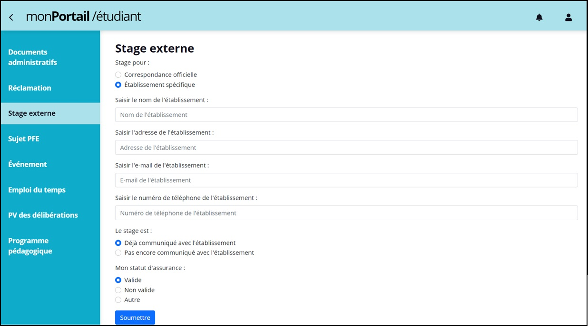
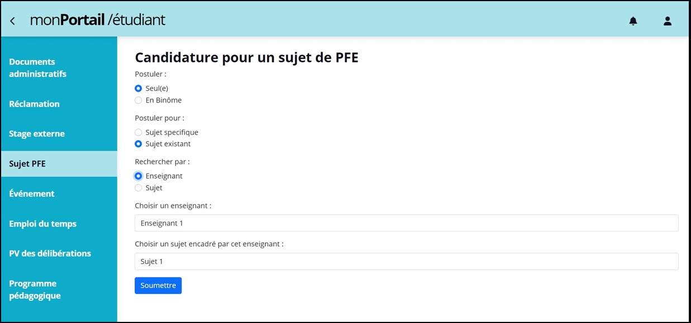
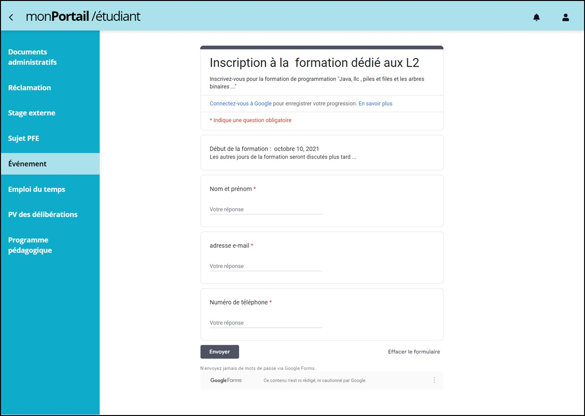
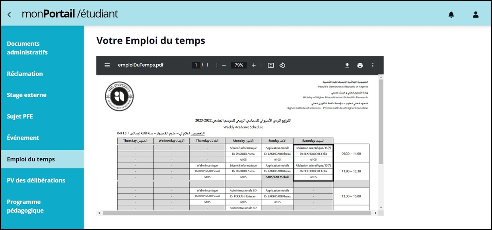

# Aperçu du projet

Voici les différentes captures d'écran de l'application :














# Projet de Fin d'Études - Système de Gestion des Inscriptions de HIS UNIVERSITY

## Introduction

Ce projet a été réalisé dans le cadre de mon projet de fin d'études de Licence. L'objectif principal est de développer un site web complet permettant de gérer les inscriptions des étudiants à HIS UNIVERSITY tout en offrant plusieurs portails personnalisés pour les **étudiants**, les **enseignants** et le **personnel administratif**.

L'application propose des fonctionnalités spécifiques pour chaque groupe d'utilisateur afin d'améliorer l'efficacité et la fluidité des processus administratifs et académiques au sein de l'université.

## Fonctionnalités Principales

### 1. Portail Étudiant

Le portail dédié aux étudiants leur permet d'accéder à un certain nombre de fonctionnalités pour faciliter leur gestion académique :

- **Inscription en ligne** : Les étudiants peuvent s'inscrire ou se réinscrire en ligne, sélectionner leurs cours, et consulter leurs informations d'inscription.
- **Consultation des résultats** : Accès direct aux relevés de notes et résultats d'examen.
- **Demande de documents officiels** : Les étudiants peuvent demander des certificats de scolarité, des relevés de notes, et autres documents administratifs.
- **Suivi de l'avancement académique** : Interface dédiée pour consulter leur progression dans les programmes académiques, y compris les crédits obtenus et les cours à valider.

### 2. Portail Enseignant

Le portail pour les enseignants leur fournit des outils essentiels pour gérer leur activité pédagogique au sein de l'université :

- **Gestion des cours** : Création et gestion des cours et des supports pédagogiques (syllabus, documents, etc.).
- **Saisie des notes** : Interface simple pour entrer les notes des étudiants par matière et par examen.
- **Suivi des absences** : Système de suivi des présences et absences des étudiants dans leurs cours.
- **Communications avec les étudiants** : Possibilité de communiquer directement avec les étudiants inscrits à leurs cours via des messages ou des notifications.

### 3. Portail Personnel Administratif

Le personnel administratif bénéficie également d'un portail qui facilite la gestion de l'université :

- **Validation des inscriptions** : Processus de validation des inscriptions en ligne soumises par les étudiants.
- **Gestion des données académiques** : Suivi des informations académiques, y compris l'édition et la modification des dossiers étudiants.
- **Génération de rapports** : Outils de génération de rapports académiques et statistiques sur les inscriptions, les résultats et les effectifs.
- **Support administratif** : Gestion des demandes administratives, y compris les demandes de documents officiels et de vérification de l’état des inscriptions.

## Technologies Utilisées

Le projet a été développé en utilisant les technologies suivantes :

- **Frontend :** 
  - **React** : Pour la création d'une interface utilisateur dynamique et réactive.
  - **Bootstrap** : Pour la conception d'une interface utilisateur moderne et responsive.
  - **jQuery** : Pour gérer des interactions utilisateur avancées et manipuler dynamiquement le DOM.

- **Backend :**
  - **Laravel** : Framework PHP robuste utilisé pour créer l'API backend et gérer la logique métier.
  - **SQL** : Pour le stockage et la gestion des données académiques et administratives dans une base de données relationnelle.

## Organisation du Projet

Le site est organisé en plusieurs modules pour assurer une gestion fluide des différents rôles et responsabilités au sein de l'université :

1. **Module d'inscription des étudiants** : Centralise toutes les informations relatives aux nouvelles inscriptions et réinscriptions.
2. **Module de gestion académique** : Pour les enseignants, incluant la gestion des cours et des notes.
3. **Module administratif** : Permet au personnel administratif de gérer les dossiers étudiants, valider les inscriptions, et générer des rapports.
4. **Système de notifications et de communication** : Pour permettre une communication efficace entre les étudiants, enseignants, et administrateurs.

## Déploiement et Installation

### Prérequis

- **Node.js** (version 14 ou supérieure)
- **PHP** (version 7.4 ou supérieure)
- **Composer** pour la gestion des dépendances PHP
- **MySQL** ou tout autre SGBD relationnel pour la base de données

### Étapes d'installation

1. Clonez le dépôt sur votre machine locale :
   ```bash
   git clone https://github.com/votre-utilisateur/projet-inscription-his-university.git
### Installez les dépendances PHP et JavaScript :

2. Installez les dépendances PHP et JavaScript :
   ```bash
   composer install
   npm install

3. Configurez le fichier .env pour connecter l'application à la base de données.

4.Exécutez les migrations de la base de données :

php artisan migrate

5.Démarrez le serveur de développement :
php artisan serve
npm run dev

